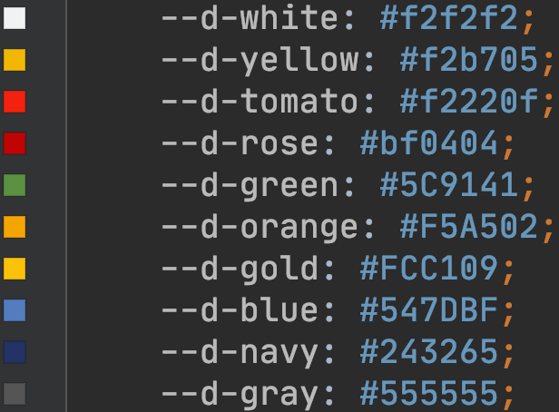

# @deptno/color

[](https://www.npmjs.com/package/@deptno/color)

color schema

## install
```shell script
npm install @deptno/color
```

## usage
ensure you already have webpack css-loader config
```tsx
/* _app.tsx */
import '@deptno/color/style.css'
```
```tsx
/* ColorComponent */
export const ColorComponent = _ => <div className="d-bg-yellow d-yellow">done!</div>
```

## color palette


## color class names
### color
```
.d-white
.d-yellow
.d-tomato
.d-rose
.d-green
.d-orange
.d-gold
.d-blue
.d-navy
.d-gray
```
### background-color
```
.d-bg-white
.d-bg-yellow
.d-bg-tomato
.d-bg-rose
.d-bg-green
.d-bg-orange
.d-bg-gold
.d-bg-blue
.d-bg-navy
.d-bg-gray
```
### named color pair sets(background-color/color)
```
.schema-border
.schema-create
.schema-update
.schema-cancel
.schema-delete
.schema-connect
.schema-search
.schema-reset
.schema-action
.schema-move
.schema-external
.schema-expandable1
.schema-expandable2
.schema-disabled
```
### typescriptlang.org color
```typescript jsx
import '@deptno/color/typescriptlang.css'
```
```
.bg-ts-blue-a { background-color: #2B6DBF; }
.ts-blue-a { color: #2B6DBF; }
.b--ts-blue-a { border-color: #2B6DBF; }

.bg-ts-blue-b { background-color: #1F508C; }
.ts-blue-b { color: #1F508C; }
.b--ts-blue-b { border-color: #1F508C; }

.bg-ts-blue-c { background-color: #002337; }
.ts-blue-c { color: #002337; }
.b--ts-blue-c { border-color: #002337; }
```

## contributors
@deptno, @sohee-lee7, @hhaze

## changelog
1.1.0 - typescriptlang.org

## license
MIT
